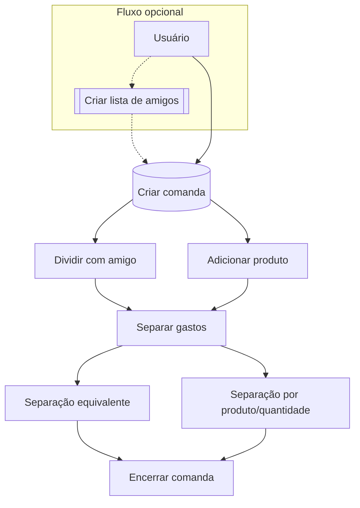
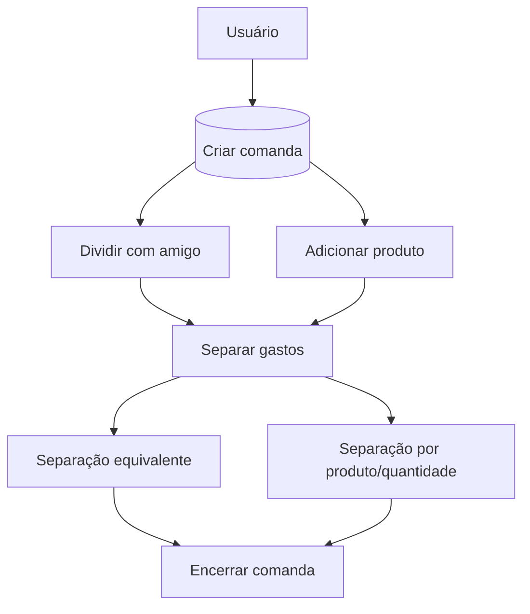

# flowchart
Nesse documento podemos ver alguns casos básicos de uso da nossa aplicação

## Fluxo geral

```mermaid
flowchart TD
    subgraph Fluxo opcional
        A[Usuário] .-> B[[Criar lista de amigos]]
    end    
        B .-> C

    A --> C[(Criar comanda)]
    C --> D[Dividir com amigo]
    C --> E[Adicionar produto]
    D --> F
    E --> F[Separar gastos]
    F --> G[Separação equivalente]
    F --> H[Separação por produto/quantidade]
    G --> I
    H --> I[Encerrar comanda]
```

## Criar comanda

```mermaid
flowchart TD
    A[Usuário] --> C[(Criar comanda)]
    C --> D[Dividir com amigo]
    C --> E[Adicionar produto]
    D --> F
    E --> F[Separar gastos]
    F --> G[Separação equivalente]
    F --> H[Separação por produto/quantidade]
    G --> I
    H --> I[Encerrar comanda]
```

